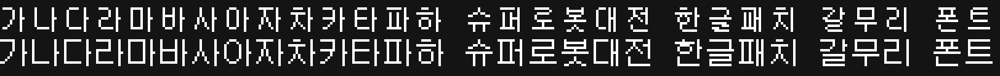
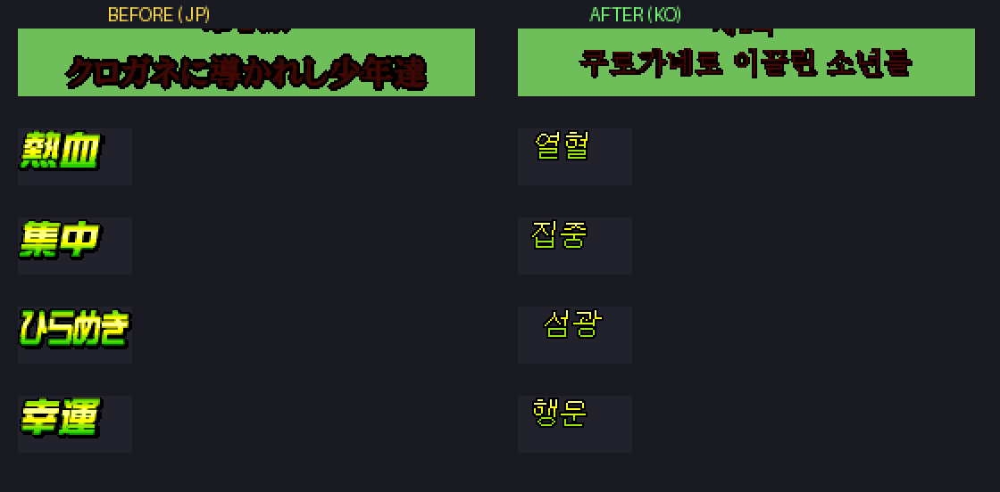
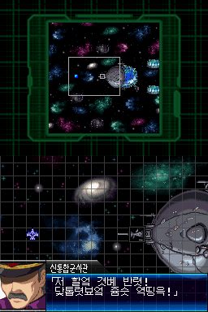

# 슈퍼로봇대전 L — 갈무리11 폰트 + 이미지 한글패치

닌텐도 DS 『슈퍼로봇대전 L』 **한글패치(v0.9.1) 롬을 개선하는 추가 패치**입니다.

- **v1.0** — 대사 폰트를 [갈무리11(Galmuri11)](https://github.com/quiple/galmuri) 비트맵 폰트로 교체 (한글 2,350자)
- **v1.1** — 그래픽(이미지)으로 그려진 일본어 텍스트 238장 한글화 (폰트 패치 포함, 이 패치 하나로 모두 적용)

## 비교

폰트 교체 (위: 기존 / 아래: 갈무리11):



이미지 한글화 (왼쪽: 원본 / 오른쪽: 한글화):



인게임 스크린샷 · [시나리오 제목 미리보기](images/titles_ko_preview.png) · [전투 HUD 미리보기](images/hud_ko_preview.png) · [오프닝 미리보기](images/intro_ko_preview.png)



## 적용 방법

이 패치는 **한글패치 v0.9.1이 이미 적용된 롬**에 덧대어 적용합니다.

1. [xdelta UI](https://www.romhacking.net/utilities/598/) 또는 xdelta3를 준비합니다.
2. 원본 파일로 **슈퍼로봇대전 L 한글패치 v0.9.1 롬**을 선택합니다.
   - MD5: `7AB930182FF9D0F4C4EFC96673E112D6`
3. 패치 파일을 선택해 적용합니다.
   - **v1.1 (폰트+이미지, 권장)**: `patch/SRWL_K_v0.9.1_Galmuri11_IMG.xdelta` → 결과물 MD5: `D5C4B3C53148E93FE3441B2E2B7D4F5C`
   - v1.0 (폰트만): `patch/SRWL_K_v0.9.1_Galmuri11.xdelta` → 결과물 MD5: `36ADDB073C1223510B2BA48B16427DF6`

명령줄 사용 시:

```
xdelta3 -d -s "SRWL_K_v0.9.1.nds" SRWL_K_v0.9.1_Galmuri11_IMG.xdelta "SRWL_K_v0.9.1_Galmuri11_IMG.nds"
```

## v1.1에서 한글화된 이미지

- **오프닝 스크롤 텍스트** — 우주. 그것은 인류에게 남겨진 최후의 프론티어…
- **시나리오 제목 카드 55장** — 프롤로그~최종화 전부, 루트 분기판 포함
- **시간 경과 카드 4장** — 며칠 후… / 1년 후… / 아득한 옛날… / 현재…
- **정신기 발동 컷인 35장** — 열혈·혼·집중·필중·섬광·불굴·철벽 등 (원본 그라데이션·검은 외곽선 재현)
- **특수능력 발동 6장** — 탄창회복·마진 파워·동탁 파워·제로시스템·접속·절단
- **전투 표시 66장** — 베어내기·쏘아떨구기·각종 배리어명·스탯 다운 L1~3·MAP병기·합체 공격 등
- **전투 HUD 사전 시트 4장** — 카운터·원호공격·크리티컬·배리어·스탯 라벨 등 약 50단어
- **전투 크리티컬 표시**, **월드맵 지역명**
- **부팅 판권 표기 화면 2장** — 판권사 한글 음차 (©·연도·영문 원문 유지)

### 원본 유지(의도적)
- 참전작 로고, 반다이남코 로고, 스태프롤, PLAYER/ENEMY PHASE 등 영문 연출
- **세이브/로드 시스템 메시지** — 3개 화면이 하나의 타일 아틀라스(256타일)를 공유하는 구조라, 한글 텍스트(296타일)가 예산을 초과해 원본 일본어 유지
- 엔딩 감사 화면 1장은 차기 버전 예정

## 기술 정보

### 폰트 패치 (v1.0)
- 폰트는 arm9 바이너리 내장(BLZ 압축), 셀 26바이트 = [SJIS 코드 u16] + [12행 × u16 픽셀]
- 한글 2,350자(가=0x889F부터 SJIS 코드 순서, KS X 1001 가나다순)를 갈무리11 ppem12(11×11 픽셀 퍼펙트)로 교체
- arm9를 원본과 동일 크기·구조로 재압축하여 헤더·체크섬 변경 없음

### 이미지 패치 (v1.1)
- 아카이브(arc03/arc05) 서브파일 교체 + FAT 재배치 방식, ROM이 약 160KB 커집니다
- ECD 압축 리소스는 엔진이 지원하는 비압축(ECD v0) 형태로 재삽입
- 시나리오 제목·오프닝·판권 화면은 타일+타일맵(SCR) 재생성, 명조 스타일은 바탕체 AA 렌더를 원본 팔레트 램프로 양자화
- 정신기 컷인은 원본 표시 영역 측정 후 돋움 크리스프 렌더 + 그라데이션 LUT + 검은 외곽선
- HUD 사전 시트는 단어별 픽셀 좌표를 잉크 런 분석으로 확정해 같은 자리에 교체
- 추출·빌드 스크립트 전체: [`tools/`](tools/)

## 원 한글패치 (기반 저작물)

이 패치는 **슈코넷(슈퍼로봇대전 한국통합사이트, http://suparobo.kr)** 에서 제작한
『슈퍼로봇대전 L 한글화 패치 v0.9.1』(2014.03.11 공개) 위에 폰트·이미지를 개선한
2차 저작물입니다. 원 한글패치의 대사·시스템 번역이 없었다면 이 패치는 존재할 수 없습니다.
원 제작팀께 깊이 감사드립니다.

### 원 패치 프로젝트 참여팀원 (슈코넷)
- **프로젝트 진행**: Jero
- **프로그래밍**: 보조인생
- **텍스트편집**: Jero
- **텍스트번역**: SAngel(SARW), 카미유비단, 백봉, 가리암, 체르베르스, 공의 경계, 샤전게, 오락쟁이, 겟타빔, 그렌, 싯쭈, 카미유, XqolopX
- **베타테스트**: 황혼시계, 가오리, 테디, 엔펨, 알시엘, 아쥬얼, Bandcy
- **오타·버그 제보(v0.9.1)**: 아이린스필, IKARI, 루키어스, 살별

### 원 패치 이용약관 (요약)
> 슈퍼로봇대전 L 한글화 패치는 슈코넷에서 **비영리 목적**으로 제작되었으며, 패치에 대한
> 권한은 슈코넷에 있습니다. 반드시 **원본 카트리지를 소유한 분**만 이용할 수 있으며,
> 패치 및 패치가 적용된 롬파일은 **제작자의 허락 없이 배포·공유할 수 없습니다.**
> 상업적 이용은 금지됩니다.

> ℹ️ 이 저장소의 폰트·이미지 개선 패치는 **원 제작팀의 배포 허락을 받아** 공개되었습니다.
> 다만 원 패치의 이용 조건은 그대로 유효하므로, 이 패치를 이용하려면 먼저 슈코넷에서
> 원 한글패치 v0.9.1을 정당하게 입수하고 **원본 게임(카트리지)을 소유**하셔야 합니다.
> 이 저장소는 원 패치나 게임 롬을 포함하지 않으며, 비영리 목적으로만 이용할 수 있습니다.

## 폰트·기타 크레딧

- **갈무리(Galmuri) 폰트**: [quiple](https://github.com/quiple/galmuri) 제작,
  [SIL Open Font License 1.1](https://scripts.sil.org/OFL) — 본 패치에는 Galmuri11의 비트맵 글리프가 포함되어 있습니다.
- 이 저장소에는 게임 롬이 포함되어 있지 않습니다. 패치 적용에는 정품 게임과 슈코넷의 한글패치 v0.9.1이 필요합니다.
- 원 패치 적용 대상 원본 롬: CRC32 `82804748` / 134,217,728 bytes
- 『スーパーロボット大戦L』 © BANDAI NAMCO Games / B.B. STUDIO
